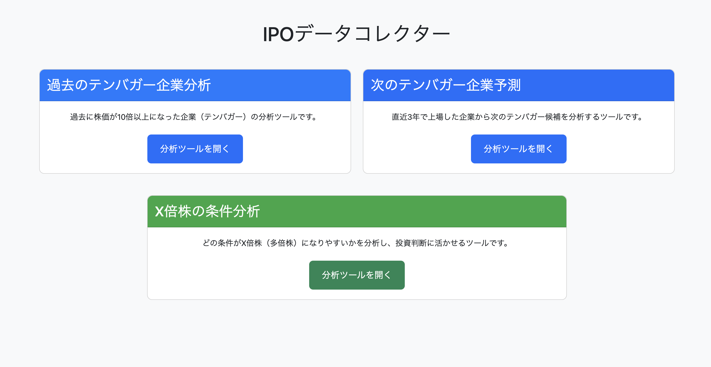

# IPO Tenbagar Analysis

IPO関連の各種データを収集・分析し、可視化するツール群です。

1. 過去にテンバガーになった上場会社の特徴分析
2. これからテンバガーになりそうな上場企業の可視化



[More of website screenshots](./doc/WEBSITE_SCREENSHOTS.md)


## セットアップ

```bash
brew install pyenv
# pyenv設定
export PYENV_ROOT="$HOME/.pyenv"
export PATH="$PYENV_ROOT/bin:$PATH"
eval "$(pyenv init --path)"
eval "$(pyenv init -)"

pyenv install 3.12.3
pyenv global 3.12.3

# 必要なパッケージをインストール
pip install -r requirements.txt
```

## データ収集の実行方法

データ収集は以下のコマンドで実行できます：

```bash
python -m collectors <collector_name>
```

利用可能なコレクター:
- `list`: IPO基礎情報リストの収集
- `details`: IPO詳細情報の収集
- `traders`: トレーダー情報の分析
- `yfinance`: Yahoo Financeからのデータ収集
- `edinet`: EDINETからの有価証券報告書ダウンロード
    - 注意点: 久しぶりに実行する際（1ヶ月ぶりなど）は `data/output/edinet_db/edinet_codes/<prefix>__doc_indexes.tsv.gz` を削除
- `comparison`: 競合他社の分析
- `ai`: AI要約の生成 -　Groqが安くなるまで待つ
- `combiner`: 各種データの統合
- `all`: すべてのデータ収集を実行

例：
```bash
# 特定のコレクターを実行
python -m collectors list
python -m collectors details
python -m collectors traders
python -m collectors yfinance
python -m collectors edinet
python -m collectors comparison 
#python -m collectors ai
python -m collectors combiner

# すべてのコレクターを実行
python -m collectors all
```

## ローカルでの可視化

可視化ツールは以下のコマンドで起動できます：

```bash
# 直接実行
python -m visualizer.app

# または、Flask CLIを使用
export FLASK_APP=visualizer.app
export FLASK_ENV=development
flask run --host=0.0.0.0 --port=8080
```

ブラウザで以下のURLにアクセスできます：
- トップページ: `http://localhost:8080/`
- 企業詳細ページ: `http://localhost:8080/<企業コード>`

## ディレクトリ構造

```
IPODataCollectors/
├── collectors/          # データ収集モジュール
│   ├── __init__.py
│   ├── __main__.py
│   ├── ipo_kiso_details_collector.py
│   ├── ipo_kiso_list_collector.py
│   └── ...
├── visualizer/          # データ可視化モジュール
│   ├── __init__.py
│   ├── app.py
│   ├── config.py
│   ├── data_service.py
│   └── chart_service.py
├── data/               # 収集したデータの保存先
│   └── output/
├── requirements.txt    # 依存パッケージ
└── README.md
```

## 注意事項

- データ収集には各種APIキーが必要な場合があります
- データ収集には時間がかかる場合があります

## Oracle Cloud Infrastructureでの環境構築

### 前提条件
- Oracle Cloud Infrastructure（OCI）のUbuntu VMインスタンスが起動済み
- SSH接続でVMにアクセス可能
- sudoコマンドが使用可能なユーザーでログイン済み

### 1. システム更新と基本ツールのインストール

```bash
# システムパッケージの更新
sudo apt update

# 必要な基本ツールのインストール
sudo apt install -y python-pip          # Python パッケージ管理ツール
sudo apt install python-venv            # Python 仮想環境作成ツール
sudo apt install nginx                   # Webサーバー
sudo apt install firewalld              # ファイアウォール管理ツール
sudo apt install iptables-persistent    # iptablesルール永続化ツール
```

### 2. Python環境の構築

```bash
# プロジェクトディレクトリに移動（例：/home/ubuntu/Projects/IPODataCollectors）
cd /home/ubuntu/Projects/IPODataCollectors

# Python仮想環境の作成
python -m venv .venv

# 仮想環境の有効化
source .venv/bin/activate

# pipのアップグレード
pip install --upgrade pip

# プロジェクトの依存パッケージをインストール
pip install -r requirements.txt
```

### 3. ファイアウォール設定

#### iptablesでの設定
```bash
# HTTP（ポート80）のアクセスを許可
sudo iptables -I INPUT 5 -p tcp --dport 80 -m conntrack --ctstate NEW -j ACCEPT

# 設定内容の確認
sudo iptables -L INPUT -n --line-numbers | grep ':80'

# 設定を永続化（再起動後も有効）
sudo netfilter-persistent save
```

#### firewalldでの設定（代替方法）
```bash
# HTTPポートの開放
sudo firewall-cmd --permanent --add-port=80/tcp

# 設定のリロード 
sudo firewall-cmd --reload

# 開放されているポートの確認
sudo firewall-cmd --list-ports
```

### 4. Gunicornサービスの設定

#### Gunicornサービスファイルの作成
```bash
sudo vim /etc/systemd/system/gunicorn.service
```

以下の内容を記述（etc/gunicorn.serviceファイルの内容を参照）：
```ini
[Unit]
Description=Gunicorn instance to serve Flask application
After=network.target

[Service]
User=ubuntu
WorkingDirectory=/home/ubuntu/Projects/IPODataCollectors
ExecStart=/home/ubuntu/.local/bin/gunicorn -w 4 -b 127.0.0.1:5000 "visualizer.app:create_app()"
Restart=on-failure

[Install]
WantedBy=multi-user.target
```

#### サービスの有効化と起動
```bash
# systemdの設定をリロード
sudo systemctl daemon-reload

# Gunicornサービスの有効化（自動起動設定）
sudo systemctl enable gunicorn

# Gunicornサービスの開始
sudo systemctl start gunicorn

# サービス状態の確認
sudo systemctl status gunicorn

# Gunicornサービスの再起動
sudo systemctl restart gunicorn
```

### 5. Nginx設定

#### Nginx設定ファイルの作成
```bash
sudo vim /etc/nginx/sites-available/ipo_visualizer.conf
```

#### Nginxサイトの有効化
```bash
# サイトの有効化（シンボリックリンク作成）
sudo ln -s /etc/nginx/sites-available/ipo_visualizer.conf /etc/nginx/sites-enabled/

# キャッシュディレクトリの作成（必須）
sudo mkdir -p /var/cache/nginx/ipo_visualizer
sudo chown -R www-data:www-data /var/cache/nginx/ipo_visualizer
sudo chmod 755 /var/cache/nginx/ipo_visualizer

# ngx_cache_purge モジュールのインストール
sudo apt-get install libnginx-mod-http-cache-purge   # または sudo apt-get install nginx-extras

# Nginx設定の構文チェック
sudo nginx -t

# Nginxサービスの再起動
sudo systemctl restart nginx

# Nginxサービスの自動起動設定
sudo systemctl enable nginx

# キャッシュの合計の容量をしれる
sudo du -sh /var/cache/nginx/ipo_visualizer
```

### 6. サービス管理コマンド

#### Gunicornサービス
```bash
# 再起動
sudo systemctl restart gunicorn

# 停止
sudo systemctl stop gunicorn

# 状態確認
sudo systemctl status gunicorn
```

#### Nginxサービス
```bash
# 設定リロード
sudo systemctl reload nginx

# 再起動
sudo systemctl restart nginx

# 状態確認
sudo systemctl status nginx
```

### 7. ログの確認方法

#### Gunicornサービスのログ
    # リアルタイムでログを表示
    journalctl -u gunicorn.service -f
    
    # 過去のログを表示
    journalctl -u gunicorn.service
    
    # サービスの状態確認
    sudo systemctl status gunicorn

#### Nginxのログ
    # アクセスログの確認
    sudo tail -n 20 /var/log/nginx/access.log
    sudo tail -f /var/log/nginx/ipo_visualizer.access.log
    
    # エラーログの確認
    sudo tail -n 20 /var/log/nginx/error.log
    sudo tail -f /var/log/nginx/ipo_visualizer.error.log

#### アプリケーションログ
Flaskアプリケーションのログは以下の場所に記録されます：
- **Gunicornサービス**: systemdジャーナル（`journalctl -u gunicorn.service -f`で確認）
- **Nginx**: `/var/log/nginx/ipo_visualizer.access.log`と`/var/log/nginx/ipo_visualizer.error.log`
- **アプリケーション**: デフォルトでコンソール出力（systemdジャーナルに記録）

### 8. トラブルシューティング

#### NGINX設定エラーの対処

**「unknown directive "proxy_cache_purge"」エラー**
```bash
# ngx_cache_purgeモジュールがインストールされていない場合
# Ubuntu/Debian系の場合
sudo apt-get install libnginx-mod-http-cache-purge
# または
sudo apt-get install nginx-extras

# 設定ファイルから該当部分をコメントアウトする場合
sudo vim /etc/nginx/sites-available/ipo_visualizer.conf
# location /admin/clear-cache { ... } ブロックをコメントアウト
```

**「mkdir() "/var/cache/nginx/ipo_visualizer" failed」エラー**
```bash
# キャッシュディレクトリを手動作成
sudo mkdir -p /var/cache/nginx/ipo_visualizer
sudo chown -R www-data:www-data /var/cache/nginx/ipo_visualizer
sudo chmod 755 /var/cache/nginx/ipo_visualizer
```

**「conflicting server name」警告**
```bash
# 重複する設定ファイルを確認
sudo grep -r "server_name.*ipo_visualizer" /etc/nginx/

# 重複ファイルがある場合は削除または無効化
sudo rm /etc/nginx/sites-enabled/重複ファイル名
```

**設定確認の基本手順**
```bash
# 1. 構文チェック
sudo nginx -t

# 2. エラーがある場合は修正後に再チェック
sudo nginx -t

# 3. 問題なければリロード
sudo systemctl reload nginx
```

### 参考資料
- [Oracle Cloud Infrastructure - Free Tier: Ubuntu VMへのFlaskのインストール](https://docs.oracle.com/ja-jp/iaas/developer-tutorials/tutorials/flask-on-ubuntu/01oci-ubuntu-flask-summary.htm)
- [Nginxでのキャッシュ設定について](https://gemini.google.com/app/eda7023cb013421a)
